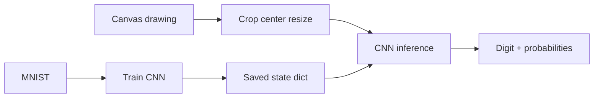

# InkSense — Handwritten Digit Recognizer

An interactive PyTorch application for drawing digits and inspecting a convolutional neural network's prediction, confidence, and full probability distribution across 0–9.

## Overview

InkSense demonstrates the full MNIST lifecycle rather than hiding training behind an API: dataset acquisition, CNN training, saved weights, browser drawing, image normalization, inference, and probability visualization.

## Features

- Freehand browser canvas with touch/mouse input
- PyTorch convolutional neural network trained on MNIST
- Predicted digit and confidence
- Probability distribution for all ten classes
- Centered 28×28 grayscale preprocessing
- Separate reproducible training script
- CPU-only inference and clear missing-model state

## Demo

Train the model and run the local Streamlit app. Model weights are generated locally and are not committed; no hosted demo is claimed.

## Tech Stack

Python, PyTorch, torchvision, MNIST, Streamlit, Pillow, NumPy, pytest

## Project Structure

```text
.
├── app.py               # Drawing and probability interface
├── model.py             # CNN, preprocessing, inference
├── train.py             # MNIST training pipeline
├── tests/test_model.py  # Shape and probability tests
└── requirements.txt
```

## How It Works



## Installation

```bash
git clone https://github.com/Sreedev-a/handwritten-digit-recognizer.git
cd handwritten-digit-recognizer
python3 -m venv .venv
source .venv/bin/activate  # Windows: .venv\Scripts\activate
pip install -r requirements.txt
```

## Usage

```bash
python train.py
streamlit run app.py
```

The first training run downloads MNIST into ignored `data/` and writes ignored weights to `models/mnist_cnn.pt`.

## Example

A white handwritten loop on the black canvas is cropped, scaled into a 20-pixel box, centered on 28×28, normalized, and passed through the CNN. The largest softmax probability becomes the displayed prediction.

## Architecture

Two convolution/pooling blocks learn spatial stroke features; a 64-unit dense layer produces ten logits. Training, domain logic, and Streamlit rendering remain separate.

## Limitations

- Training is CPU-intensive and requires the one-time MNIST download.
- Drawings unlike MNIST's centered grayscale style can reduce accuracy.
- Confidence is a softmax score and may be overconfident.

## Future Improvements

- Bundled release weights and measured test accuracy
- Canvas centering preview
- Calibration metrics and confusion matrix
- ONNX browser inference

## Contributing

Fork, create a focused branch, add tests, and open a pull request. Do not commit datasets or generated weights.

## License

MIT. See `LICENSE`.

## Author

Sreedev A — [@Sreedev-a](https://github.com/Sreedev-a)
